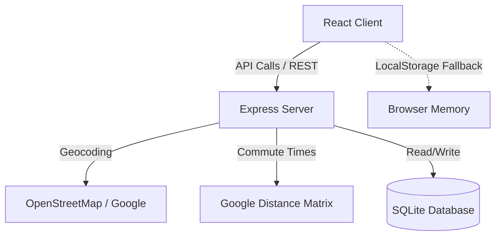

# VibeNest - Weighted Apartment Comparison & Shopping Tool

VibeNest is a modern, responsive, and visual full-stack web application designed to help you and a partner search, score, and rank apartment listings using customized weighted criteria. 

Whether you are prioritizing low rent, short commutes, or specific amenities (like in-unit laundry or natural light), VibeNest calculates a normalized score (from `0%` to `100%`) for every listing based on your joint weights.

---

## Key Features

1. **Dual-User Scoring Engine**: Customize weight priorities from `1` to `5` for both you and your partner. Pros add to the score, and Cons act as penalties.
2. **Interactive Map (Leaflet)**: Plots all listings and custom Points of Interest (POIs, e.g., Work, Gym, Groceries) in a dark-mode theme.
3. **Commute Travel-Time Matrix**: Automatically calculates driving times and distances (in miles) for normal and rush-hour traffic.
4. **Interactive Listings View**:
   - Toggle between **Grid** and **List** layout formats.
   - Click apartment names to visit the source listing URL.
   - Click addresses to open Google Maps directly.
   - Upload floorplans by simply copying an image from Zillow/apartments.com and pasting (**Ctrl+V** / Clipboard paste) inside the form.
   - Hover over floorplan thumbnails to see a large zoom overlay.
5. **Dynamic Attribute Filters**: Showcases the 5 most common apartment attributes as quick-toggle pills and tucks the remaining into a dropdown checkbox list. Pill counts show dynamic matching numbers.
6. **Dual Data Storage Systems**:
   - **Docker API Mode**: Persists listings in a local SQLite database and uses Nominatim/Google Maps APIs.
   - **Standalone Browser Mode**: If the backend server is offline, the client automatically falls back to storing data locally inside your browser (`localStorage`). It estimates commutes using the Haversine formula, enabling 100% free hosting.
7. **JSON Backup Import/Export**: Save backups of your listings as a JSON file and restore them on another machine or browser.

---

## Technical Architecture

VibeNest is structured as a decoupled multi-container application:



### Frontend (`/frontend`)
*   **Vite + React**: Fast build tool and modular component structure.
*   **Tailwind CSS**: Custom dark glassmorphic styling layout.
*   **Lucide React**: Clean vector iconography.
*   **Leaflet Maps**: Renders maps, custom markers, and POIs.
*   **Recharts**: Visualizes score comparison charts.

### Backend (`/backend`)
*   **Node.js + Express**: REST API endpoints for apartments, POIs, criteria, and settings.
*   **SQLite**: Self-contained serverless SQL database database.
*   **Multer**: Handles multipart uploads for floorplan images.
*   **Distance Services**: Automatically geocodes addresses and queries Google Distance Matrix APIs for commute estimates.

---

## How to Run Locally (Docker Setup)

Make sure you have **Docker** and **Docker Compose** installed on your system.

### 1. Build and Start Containers
Navigate to the root directory `C:\ApartmentShopping` and run:
```bash
docker-compose up --build -d
```

### 2. Port Allocation
*   **Frontend Client**: [http://localhost:8282](http://localhost:8282)
*   **Backend Server API**: [http://localhost:5252](http://localhost:5252)

### 3. Database Persistence
Data is saved locally inside a SQLite file in the root workspace folder under `./backend/data/database.sqlite`. Floorplan uploads are stored under `./backend/uploads/`. Both are mounted as persistent volumes inside the docker container, meaning your listings will not be deleted during container rebuilds.

### 4. Stopping Containers
To stop the local environment, run:
```bash
docker-compose down
```

---

## Static Serverless Deployments (GitHub Pages, Vercel, Netlify)

Because VibeNest includes **Standalone Browser Mode**, you can compile the React frontend into static assets and deploy it for free to any web hosting service without running a backend server!

### How to Publish to GitHub Pages:
1. Create a repository on GitHub (e.g. `https://github.com/your-username/ApartmentShopping`).
2. Link your local project:
   ```bash
   git remote add origin https://github.com/your-username/ApartmentShopping.git
   git push -u origin main
   ```
3. Deploy the frontend branch:
   ```bash
   cd frontend
   npm run deploy
   ```
   *(This builds your files and pushes the compiled `dist/` directory to the `gh-pages` branch).*
4. In your GitHub repository settings, go to **Pages** and set the branch to **`gh-pages`** and save.
5. Your live app is ready at `https://your-username.github.io/ApartmentShopping/`.
